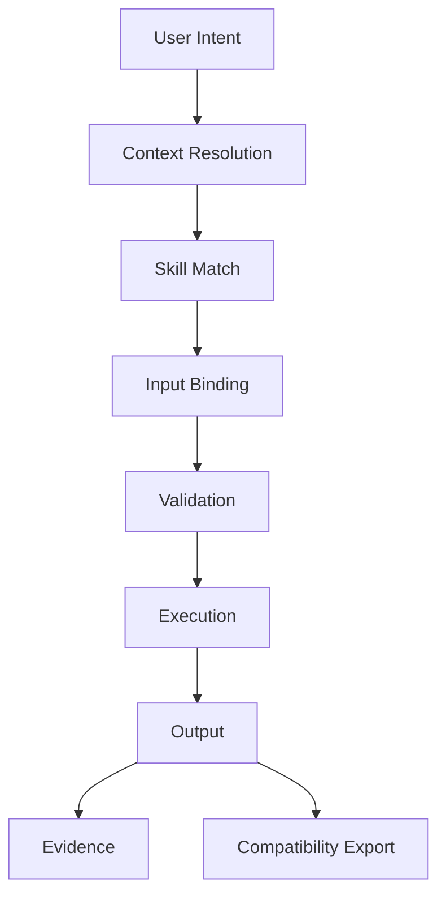

# Skill Engine Flow v0.2

```mermaid
flowchart TD
    A[User Intent] --> B[Context Resolution]
    B --> C[Skill Match]
    C --> D[Input Binding]
    D --> E[Validation]
    E --> F[Execution]
    F --> G[Output]
    G --> H[Evidence]
    G --> I[Compatibility Export]
```

## Note

This is the minimal conceptual flow for the repo snapshot.
